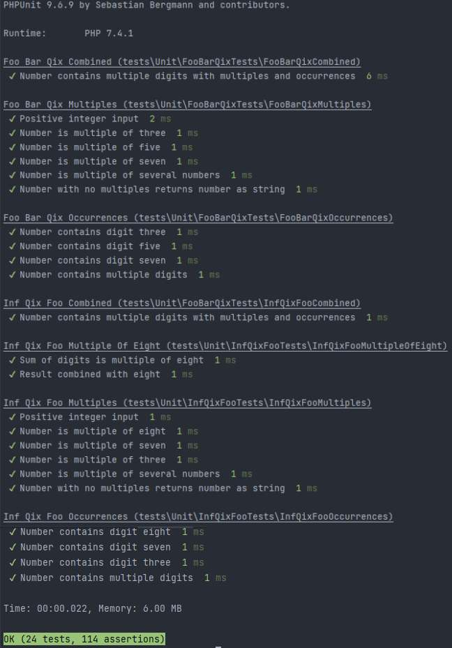

# FooBarQixExtended

FooBarQixExtended is a PHP 7.4 application that is made using TDD approach. 

### Installation

To install FooBarQixExtended, follow these steps:

1. Clone the repository to your local machine using the following command:

git clone https://github.com/azemitis/FooBarQixExtended.git

2. Navigate to the project directory:

cd FooBarQixExtended

3. Install the dependencies using Composer:

composer install

### Running Tests

To run the tests for FooBarQixExtended, use the following command:

vendor/bin/phpunit --verbose --testdox --colors tests

This command will execute the PHPUnit test suite and display detailed information about the test results, including test names, passed tests, and any failures or errors encountered during testing.
